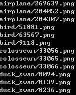

# generate_filelist
## 起始步，生成图像文件路径索引 :maple_leaf:
----------------

#### **说明**

本程序为系统生成图像文件路径索引，因此是起始步，在后续步骤中，均需要通过本步生成的索引去读取图像文件。

本程序拥有两个功能：一是建立图像文件路径索引，二是读取索引文件，在控制台窗口查看索引内容。根据使用场景的不同，可通过输入参数对功能进行详细修改。

----

#### **索引结构**

在文件``filelist.hpp``中，``FileList``类的每条方法都有详细的英文说明，其中，

```
class FileList
{
	public:

	private:
    string         _rootdir;
    vector<string> _files;
};
```

参数``-d``设置的文件根目录由类私有成员``_rootdir``保存，而遍历的图像文件名由``vector<string>``类型的私有成员``_files``保存。

----

#### **用例**

生成图像索引

```
generate_filelist -d . -t *.png -o filelist_png
```

查看索引内容

```
generate_filelist -f filelist_png
```

----

#### **输入**

generate_filelist [options]

> options:

 | --rootdir | -d   | 可选 |
 |--------------|------|------|

设置遍历文件的根文件路径，即指定程序在该根目录下遍历图片。若不设置，则默认为``.```，即指定遍历在该程序的当前路径下的所有图像。

 | --namefilters | -t   | 必须 |
 |--------------|------|------|

筛选条件，定义遍历的图像格式，例如``*.jpg``或``*.png``，必填项。

 | --filelist | -f   | 可选 |
 |--------------|------|------|

输入已存在的图像索引文件，在控制台窗口中输出文件内容。若使用该功能，则其余功能无法使用。

 | --outputfile | -o   | 可选 |
 |--------------|------|------|

设置图像索引的输出文件名。若不设置，则默认在控制台窗口中输出索引内容。

 | --random-sample | -r   | 可选 |
 |--------------|------|------|

设置定值，为随机筛选出对应数量的图像文件建立路径索引，可选项。

 | --seed | -s   | 可选 |
 |--------------|------|------|
 
若执行``-r``随机筛选图像命令，其随机种子的选取可由``-s``本参数设置。若指明数值，则默认使用当前时间作为随机种子。

----

#### **输出**

在``./test/img_set``中我上传了一些图像例子，可使用下列代码构建``./test/img_set``的图像路径索引。

建立索引：

```
generate_filelist.exe -d img_set -o img_set_filelist -t *.png
```
查看索引文件：
```
generate_filelist.exe -f img_set_filelist
```

