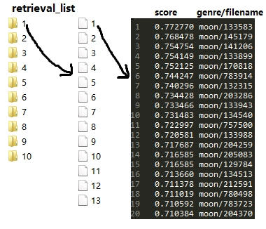

#### image_search_featureExtracted

----------------

**说明**

基于 ``image_search`` 源码进行了修改，增添了在控制台输出检索结果 ``#define SHOW_RESULT`` 与保存检索结果 ``#define SAVE_SCORE`` 选项，并使程序能够执行批处理。

``image_search(_featureExtracted)`` 本程序为SBIR的最终步，生成检索结果。具体来说，是输入检索序列，与图片集进行BoF特征匹配，并以“分数 文件名”的形式储存，即检索序列的每张图像与图片集的每张图像进行特征匹配。

**搜索参数**

本程序支持BoF检索框架与线性检索框架，此处需要通过输入参数``-s``或``-m``定义所使用的检索框架。

* BofSearch
	- search_type = BofSearch
	- index_file = [index_file的路径，由``compute_index``程序生成]
	- tf = [若不设置，则默认为constant]
	- idf = [若不设置，则默认为constant]
* LinearSearch
	- search_type = LinearSearch       
    - descriptor_file
    - distfn
    是否是tensor
    - name = tensor          

**用例**

```
image_search_featureExtracted.exe -d queryDes -q queryFilelist -m search_type=BofSearch index_file=galif_tfidf -v shogVoc -l imgFilelist -g shog -r .
```

**输入**

image_search [options]

> options:

 | --descriptor | -d   | 必须 |
 |--------------|------|------|

由``compute_descriptors``程序生成的检索序列的*descriptor*，即检索序列中每张检索图像的特征向量集合。

 | --queryimage | -q   | 必须 |
 |--------------|------|------|

由``generate_filelist``程序生成的检索序列图像集的相对路径

 | --searchptree | -s   | 可选 |
 |--------------|------|------|

以JSON格式编写的搜索参数文件名。若``-s``本项不给出，则``-m``变为必填选项。

 | --searchparams | -m   | 必须 |
 |--------------|------|------|

搜索参数，定义本程序使用BoF检索框架还是线性检索框架。若``-m``本项不给出，则``-s``变为必填选项。

 | --vocabulary | -v   | 可选 |
 |--------------|------|------|

由``compute_vocabulary``程序生成的图片集的*vocabulary*，或称之为*codebook*，即图片集的视觉词汇表。若搜索参数定义使用BoF检索框架，则本项变为必填项。

 | --filelist | -l   | 必须 |
 |--------------|------|------|

由``generate_filelist``程序生成的图片集的相对路径。

 | --generatorptree | -p   | 可选 |
 |--------------|------|------|

以JSON格式编写的*generator*图像特征所使用的参数文件名。若``-p``本项不给出，则``-g``变为必填选项。

 | --generatorname | -g   | 可选 |
 |--------------|------|------|

*generator*图像特征名，若提供，本程序则使用默认特征的参数。实际上，本选项对结果并无影响，因为本项原意是对检索图片采用``-g``特征提取方法提取特征向量后，再输入至BoF检索框架，我为了能够批量处理，在``-d``处早已提供检索序列的特征集，故不必再次提取``-g``特征。若``-g``本项不给出，则``-p``变为必填选项。

 | --generatorname | -n   | 可选 |
 |--------------|------|------|

设置检索数目，若本项不给出，则默认输出所有检索结果。

 | --working dir | -r   | 必须 |
 |--------------|------|------|

设置检索序列的绝对路径。

 | --saving dir | -o   | 可选 |
 |--------------|------|------|

设置保存检索结果的相对路径，若本项不给出，则默认相对路径为"\retrieval_list\"。

**输出**

如图，输入的检索序列按“1、2、3、4、...”命名分类，每类中含有检索图片若干张，输出则是以"retrieval_list"命名的文件夹，文件夹内含与检索序列分类同名的若干子文件夹，如左图所示；每个子文件夹中含以检索图片为检索输入的检索结果，如中图所示；检索结果按“分数 类别/文件名”的形式保存，如右图所示。

